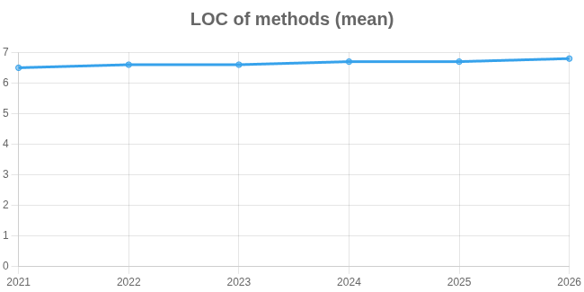

# 📈 Análise de Evolução de Código com GitEvo

Este repositório contém a resolução da atividade de exploração da evolução de código em sistemas reais, utilizando a ferramenta de análise estática **GitEvo**.

---

## 🔍 Repositório Analisado

* **Projeto:** [Spring Boot](https://github.com/spring-projects/spring-boot)
* **Linguagem:** Java
* **Foco da Análise:** Manutenibilidade e Complexidade de Métodos

## 📊 Gráfico de Evolução

*(Gráfico detalhando a relação entre o crescimento do código e o tamanho dos métodos)*

## 💡 Explicação dos Dados

O gráfico selecionado demonstra a evolução do volume total de linhas de código (LOC) em comparação com o tamanho médio dos métodos ao longo dos anos no projeto Spring Boot.

### Crescimento vs. Complexidade
Analisando os dados, observamos que o repositório teve um crescimento expressivo, saltando de **541.530 linhas** de código em 2021 para **823.679 linhas** em 2026.

No entanto, mesmo com esse aumento massivo e a adição contínua de novas funcionalidades, a complexidade estrutural no nível dos métodos permaneceu estritamente controlada. A média de linhas por método (*LOC of methods mean*) sofreu uma variação mínima no período, passando de apenas **6.5** em 2021 para **6.8** em 2026.

### Conclusão sobre Boas Práticas
Esse comportamento evidencia uma aplicação rigorosa de boas práticas de engenharia de software e princípios de *Clean Code* por parte da equipe de mantenedores. As curvas demonstram que o crescimento do sistema se dá de forma modular — através da criação de novas classes e componentes — e não pelo inchaço das funções existentes.

Isso garante que o framework se mantenha:
* **Escalável:** permitindo o crescimento seguro da base de código.
* **Altamente testável:** com métodos curtos e de responsabilidade única.
* **Fácil manutenção:** reduzindo a carga cognitiva de quem lê e altera o código a longo prazo.